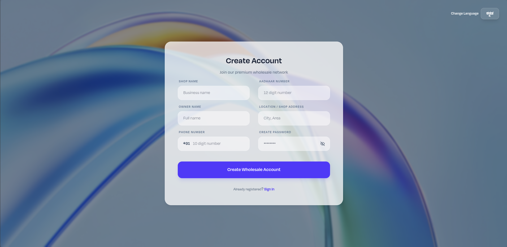
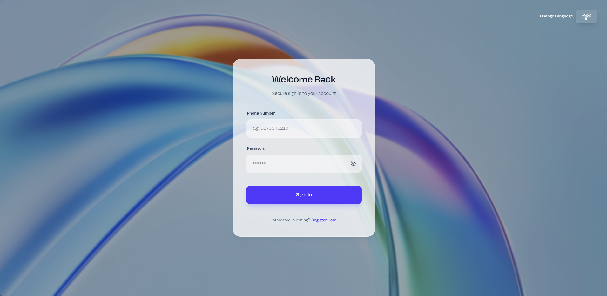
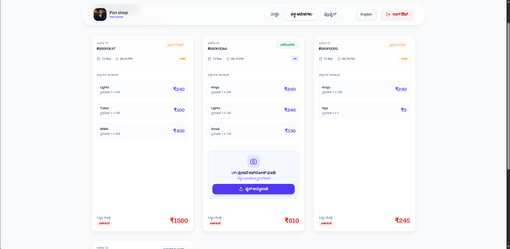
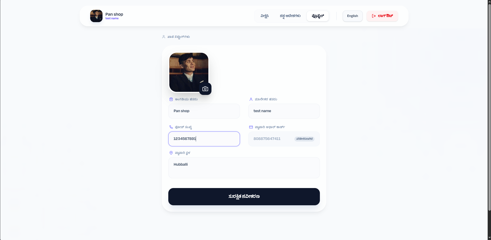
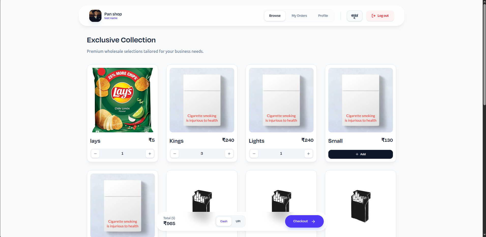
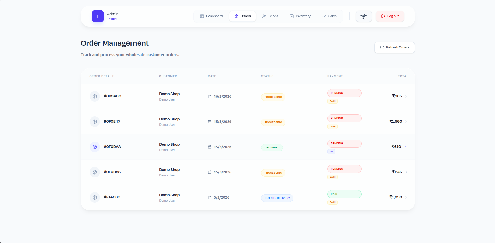
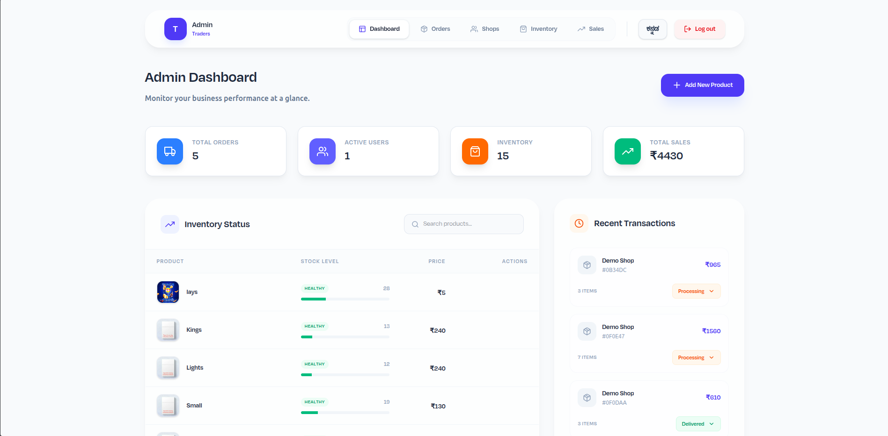
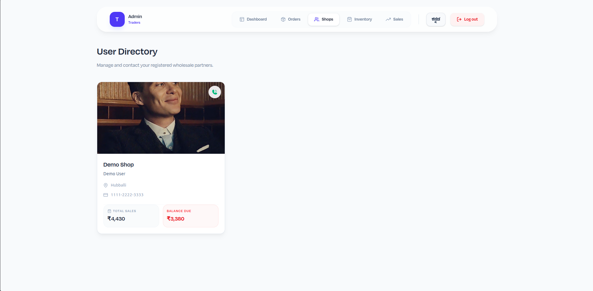
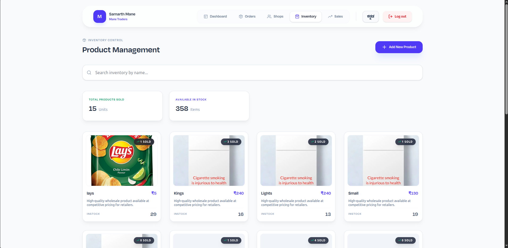
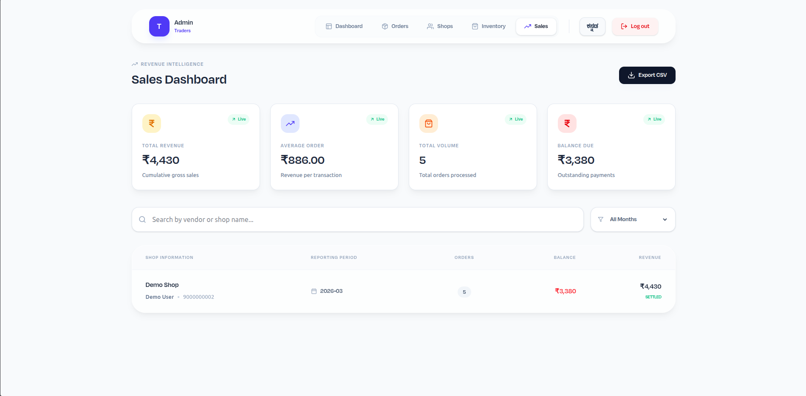

# Wholesale Order-App (MERN) 🚀

A comprehensive B2B Wholesale Management System built with the MERN stack. This application digitizes manual order workflows, tracks inventory, and provides business intelligence for wholesale merchants.

---

## 📸 Screenshots

### 👤 User Interface
<div align="center">
  
  
</div>

<div align="center">
  
  
</div>
<div align="center">
  
</div>

<div align="center">
  
</div>

### 🛠️ Admin Dashboard
<div align="center">
  
  
</div>

<div align="center">
  
  
</div>

---

## 🌟 Key Features

- **Full MERN Stack**: Built with MongoDB, Express.js, React, and Node.js.
- **Multilingual Support**: Fully localized in English and Kannada using `i18next`.
- **B2B Logic**: Specialized workflows for wholesale transactions, including GST/Aadhaar verification.
- **Inventory Management**: Real-time stock tracking and low-stock alerts.
- **Order Lifecycle**: Complete tracking from "Processing" to "Delivered".
- **Payment Verification**: UPI payment screenshot upload and admin validation.
- **PWA Ready**: Mobile-friendly and installable as a Progressive Web App.

## 📁 Project Structure

```text
order-app/
├── backend/            # Express.js server & Node.js API
│   ├── config/         # Database configuration
│   ├── controllers/    # Business logic for routes
│   ├── models/         # Mongoose schemas (User, Product, Order)
│   ├── routes/         # API endpoint definitions
│   └── uploads/        # Local storage for payment proofs
├── frontend/           # React.js client (Vite)
│   ├── src/
│   │   ├── api/        # Axios instances & API calls
│   │   ├── components/ # Reusable UI components
│   │   ├── pages/      # Application views (User & Admin)
│   │   └── i18n.js     # Multilingual configurations
└── documentation       # Raw API reference & notes
```

## 🛠️ Getting Started

### Prerequisites

- Node.js (v18+)
- MongoDB (Local or Atlas)
- npm or yarn

### Installation

1. Clone the repository:
   ```bash
   git clone https://github.com/akashkurdekar7/order-app.git
   cd order-app
   ```

2. Setup Backend:
   ```bash
   cd backend
   npm install
   # Create a .env file
   npm run dev
   ```

3. Setup Frontend:
   ```bash
   cd ../frontend
   npm install
   npm run dev
   ```

## 🔐 Environment Variables

Ensure you have a `.env` file in the `backend/` directory with the following:

- `PORT`: Server port (default: 9858)
- `MONGODB_URI`: Your MongoDB connection string
- `JWT_SECRET`: Secret key for authentication
## 🔗 Links

- **GitHub Repository**: [https://github.com/akashkurdekar7/order-app.git](https://github.com/akashkurdekar7/order-app.git)
- **Live Demo**:[ *Coming Soon*](https://order-app-olive.vercel.app/)

## 📞 Contact

- **GitHub**: [@akashkurdekar7](https://github.com/akashkurdekar7)
- **LinkedIn**: [Akash Kurdekar](https://www.linkedin.com/in/akashkurdekar/)

## 📄 License

This project is licensed under the MIT License - see the [LICENSE](LICENSE) file for details.
